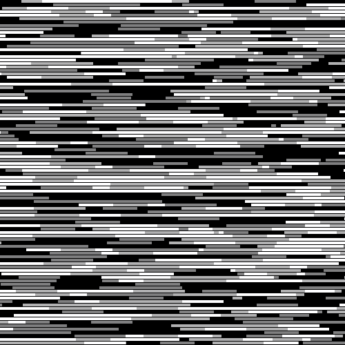
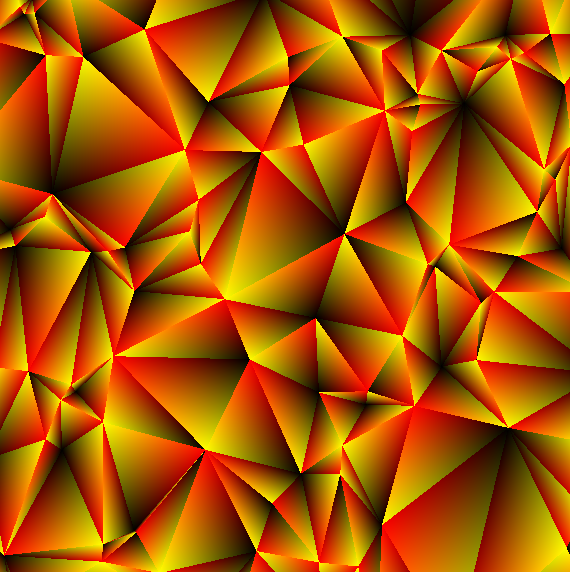
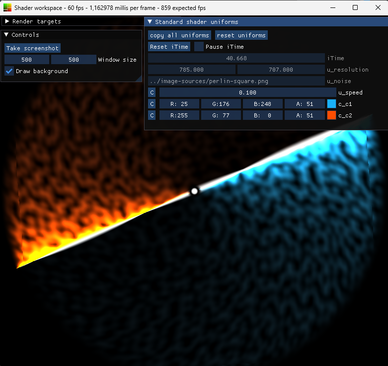

# Shaders Workspace

A collection of shaders and a tool for real-time rendering and developping for shaders!

## Some shaders

|  |  |
|-|-|
|  |  |



These are animated when run.

## DSD

The DSD (dynamic shader display) tool is a renderer for fragment shaders, you can use it to run any shader in this repository.

It supports OpenGL shaders like you would find on [shadertoy](https://shadertoy.com). *DSD is not an editor*, you may use any text or shader editor, Using VSCode + a glsl extension works great for me.

To run dsd, first download or build the .jar file, then use one of the following commands:

```bash
# Simply open a window displaying the shader
java -jar dsd.jar run shader.fs

# Create a file full of useful snippets
java -jar dsd.jar listsnippets
java -jar dsd.jar snippets >> snippets.fs

# Check your openGL version
java -jar dsd.jar systeminfo

# Generate a 10s video
java -jar dsd.jar video shader.fs -d 10
# Apply a shader to some images
java -jar dsd.jar image shader.fs someimage1.png someimage2.jpg
# Save a single frame
java -jar dsd.jar screenshot shader.fs output.png

# Run dsd with all shader stages
java -jar dsd.jar -c compute.cs -g geometry.gs -v vertex.gs fragment.fs

# Get help
java -jar dsd.jar --help <command>
```

Java 16+ is needed in order to run dsd.

DSD has been tested on Windows 10, it should also work on OSX/linux but no guaranties are made (if you encounter crashes with ImGui add `--no-gui`).

Note that on Mac OS X you will need to add `-XstartOnFirstThread` before `-jar`, also you may need to specify the version of OpenGL using `--force-gl-version <version>` because Metal is not supported.

### Using uniforms

- Uniforms of type `mat2/3/4`, `vec2/3/4` and `float` will appear with controls in the HUD. Uniforms of type `vec3/4` and with a name starting with `c_` will have color controls instead.
- Special uniforms `vec2 i_resolution`, `int iFrame`, `float iTime` are always available.
- Uniform arrays and non-square matrices are not yet supported.
- 2D textures are supported (see the next section).

### Using textures

Textures are defined directly in code, using a comment to specify the data source

```glsl
/* Load a texture directly from files */
uniform sampler2D u_texture; // path/to/image.png
/* Use one of the built-in textures */
uniform sampler2D u_texture; // builtin 1
/* A render target (see the next section) */
uniform sampler2D u_texture; // target 0
/* When running with the "image" command, use the input image 
   the fallback is any of the above options */
uniform sampler2D u_texture; // input or <fallback>
```

### Render targets

```glsl
uniform sampler2D u_previousFrame; // target 0
uniform sampler2D u_target1; // target 1

layout(location=0) out vec4 color;
layout(location=1) out vec4 target1out;
```

All `out` targets must be written to every frame, render targets are double-buffered, if you write to `color` you won't see a change to `u_previousFrame` until next frame.

You may want to add the `-rt` flags when using render targets:
- `-r`: Resets the iTime uniform when shaders are updated
- `-t`: Clears the render target textures when shaders are updated

### Generating videos and images

**Common options**: `--fps <fps>`, `--width/-w <w>`, `--height/-h <h>`, `--output/-o <file>`\
**Video options**: `--first-frame/-f <f>`, `--last-frame/-l <f>`, `--duration/-d <d>` (in seconds), `--ffmpeg-path <path>`\
**Image options**: `--size-to-image/-s`\
**Screenshot options**: `--screenshot-frame <f>`, `--run-from <firstframe>`

See the help for individual commands `java -jar dsd.jar ? video`.

[ffmpeg](https://ffmpeg.org/download.html) is required to generate videos.

Image and screenshot are very similar, but image works on multiple input images but runs for a single frame per image, use screenshot if you are using render targets.

### Snippets

Snippets can be accessed at runtime by entering `snippets` or `snippets <filter>`, add `-c` to print their codes instead of the snippets list and `-o <file>` to write the snippets to a file.

Snippets file are searched for when starting the app, all files ending in `.snippets` near the execution directory will be scanned for snippets. Snippet syntax and example:
```
BEGIN <name>
<snippet body>
EOS

BEGIN Universal constants
#define PI 3.141592
EOS
```

### Custom input data

To render things on the screen that cannot be completely generated through a fragment shader (such as points and lines) you can either:
- define your own vertices in a geometry shader
- use a compute shader
- load vertex data from a file
- generate the data on the fly using an external script

> Note that currently, only the vertices positions can be user-defined. Additional data must be derived if necessary, in the geometry shader for example.

#### The geometry shader

To add a geometry shader stage, use `--geometry <file>` or `-g <file>`.

The geometry shader can be used to take in vertex data and output some (possibly unrelated) other vertices. For example:

```glsl
#version 400 core

#define INSTANCES 32
#define VERTICES 2

layout(triangles) in; // mandatory, even if you do not use the input vertices
layout(invocations = INSTANCES) in;
layout(line_strip, max_vertices=VERTICES) out;

void main(void) {
  // output the 2 points defining a line
  // the positions of the points may depend on gl_InvocationID and the input data
  gl_Position = ...;
  EmitVertex();
  gl_Position = ...;
  EmitVertex();
  EndPrimitive();
}
```

Use `INSTANCES` and `gl_InvocationID` to generate lots of primitives, `VERTICES` has a limit that isn't that high.
See a full example at `/shaders/circled_sphere.gs`, use the default fragment shader.

#### The compute shader

The compute shader is not the prefered way to input custom vertex data, but is still worth looking at.
To add a geometry shader stage, use `--compute <file>` or `-c <file>`.
Currently only triangles may be generated, to output other types of primitives use the geometry shader. See a full example at `/shaders/compute`.

#### Using an input file

Raw input files may be used with `--input <file>` or `-i <file>`.

The input file is fully read at each reload and must respect the following format:\
The file must start with the type of primitive it contains, either `points`, `lines` or `triangles`.\
The remaining of the file will be read in groups of 4 floats per vertex, separated by any white character (spaces, line feeds, tabs...) or semi-column (.csv files should in theory be fully supported).

The first three values in a vertex are its xyz-position and the fourth should always be 1, for example:

```
points
-1 -.5 0 1
1 -.5 0 1
1.73 .5 0 1
```

#### Using a script file

An external script can also be used with `--script <file>`. The executable will be run on each reload and its output will be parsed exactly as if it was an input file.

To debug the script output you can either simply run the script without dsd or use `--script-log <length>`.

For example, using python:
```python
#!/usr/bin/python3

# generates a random point in range (0, 0, 0, 1) to (1, 1, 0, 1)
def randpoint():
  ...

print("lines")
for i in range(100):
  print(randpoint())
  print(randpoint())
```

> You need to make the file executable (`chmod u+x script.py` on linux).

> The scripts are reexecuted each time a file changes, if it takes too long to run simply save the script output to a file and then run dsd with the file as input directly.

## Build instructions:

Install dependencies using Maven, [`fr.wonder.commons(.systems)`](https://github.com/Akahara/fr.wonder.commons.systems) are not avaible on maven and must be included from `/lib` or built from source.
